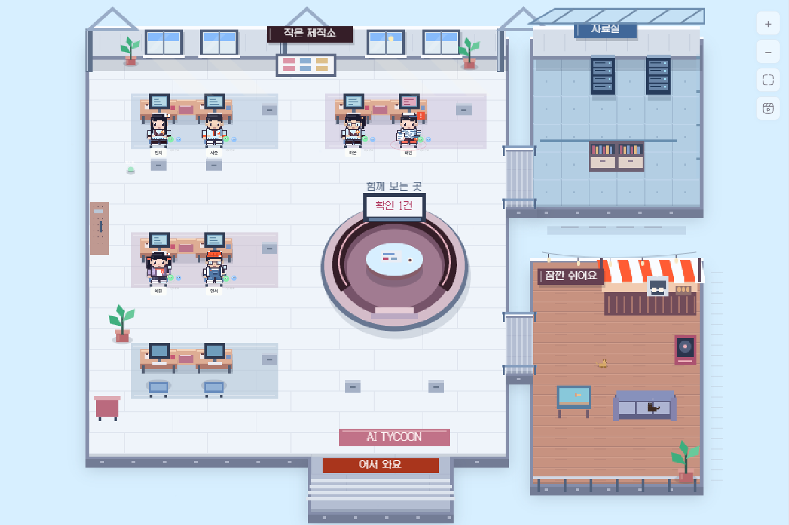
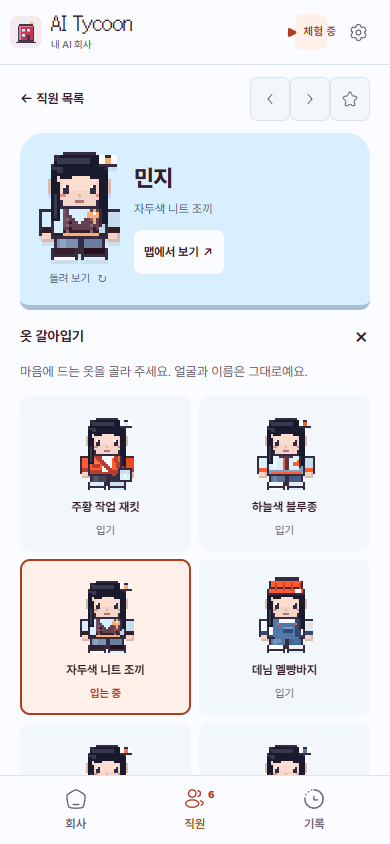
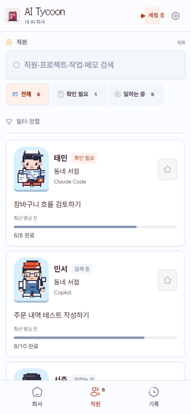

<p align="center"></p>
<h1 align="center">AI Tycoon</h1>
<p align="center"><strong>내 AI들은 지금 무슨 일을 하고 있을까?</strong><br>터미널 뒤에서 일하는 AI들을 작은 픽셀 회사에서 만나보세요.</p>

<p align="center">
  <a href="https://github.com/easygap/AI-Tycoon/actions/workflows/ci.yml"></a>
  <a href="LICENSE"></a>
  <a href="https://nodejs.org"></a>
</p>

<picture>
  <source media="(prefers-color-scheme: dark)" srcset="docs/hero-dark.png">
  
</picture>

Claude Code, Codex, Cursor처럼 여러 AI 도구를 함께 쓰다 보면 누가 뭘 하는지 확인하느라 창을 자주 오가게 됩니다. AI Tycoon은 그 상태를 한 화면에 모아 보여줍니다. 일을 시작하면 직원이 출근하고, 검색하거나 코드를 작성할 때는 행동이 달라집니다.

**경영 게임처럼 생긴 로컬 작업 대시보드입니다.** 지금 진행 중인 일을 구경하고, 확인할 작업을 찾고, 직원별 메모를 남길 수 있어요.

## 바로 실행하기

[Node.js](https://nodejs.org) 20 이상을 설치한 뒤 실행하세요.

```bash
git clone https://github.com/easygap/AI-Tycoon.git
cd AI-Tycoon
npm install
npm start
```

브라우저가 자동으로 열립니다. 주소는 **http://localhost:3777**입니다.

아직 AI 도구를 켜지 않았다면 **http://localhost:3777/?demo=1**에서 예시 직원들과 먼저 둘러보세요. 체험 중이라는 표시가 나오며, 예시 데이터는 실제 작업 기록과 따로 저장됩니다.

## 작업실, 자료실, 테라스를 한 바퀴

직원들은 작업실과 자료실, 카페 테라스를 오갑니다. 가운데에는 함께 작업을 확인하는 둥근 자리가 있고, 파란 유리 지붕과 주황색 차양 아래에는 잠깐 들러 볼 공간들이 있어요.

화면의 **전체 맵** 메뉴에서 원하는 공간을 고르면 크게 볼 수 있습니다. 휴대폰에서도 테라스의 고양이와 수족관, 작업대의 모니터를 가까이서 구경해 보세요.



## 캐릭터만 봐도 알 수 있게

직원들은 키보드를 두드리고, 돋보기로 살펴보고, 확인할 자료를 들고 이동합니다. 머리 모양과 옷, 소품이 서로 달라 직원 목록에서도 같은 얼굴을 찾을 수 있어요. 창밖 풍경은 컴퓨터의 시간에 따라 달라집니다.


## 출근룩도 내 취향대로

하늘색 블루종, 자두색 니트 조끼, 주황 작업 재킷. 옷깃부터 가방과 신발까지 서로 다른 여섯 벌을 준비했어요. 색뿐 아니라 옷의 모양도 다릅니다.


**직원 카드를 열고 ‘옷 갈아입기’를 눌러 보세요.** 얼굴과 이름은 그대로 두고 옷만 바꿀 수 있습니다. 캐릭터를 누르면 뒤쪽 모습도 볼 수 있고, ‘맵에서 보기’를 누르면 그 직원이 있는 곳으로 이동합니다. 고른 옷은 같은 브라우저에 저장돼요.

<p align="center"></p>

배색과 코디는 2026년 Pinterest 색상·스타일 자료와 실제 패션 컬렉션을 참고했습니다. [무엇을 참고하고 어떻게 적용했는지](docs/STYLE-2026.md)도 정리해 두었습니다.

## 휴대폰에서는 세 개의 메뉴로

**회사**에서 장면을 보고, **직원**에서 지금 하는 일을 읽고, **기록**에서 최근 활동을 확인합니다. 긴 프로젝트명과 작업명은 줄을 바꿔 표시합니다. 자주 쓰지 않는 필터와 정렬은 접어 두었습니다.

<p align="center">
  
  
  
</p>

## 음악은 듣고 싶을 때만

화면 아래 라디오를 켜면 직접 만든 배경음악이 재생됩니다. 낮과 밤, 확인할 일이 있는 상황에 맞춰 음악이 달라져요. 출근·작업 완료·확인 요청에는 서로 다른 짧은 효과음이 나옵니다.

음악과 알림음은 각각 켤 수 있고, 볼륨도 따로 조절합니다. 다른 탭으로 이동하면 음악이 멈춥니다. `M` 키를 누르면 모든 소리가 꺼집니다.


## 자세히 볼 때는 직원 화면에서

직원 카드를 열면 현재 작업, 세션 정보, 최근 활동과 메모를 볼 수 있습니다. 검색창에서는 직원 이름뿐 아니라 프로젝트·작업·메모도 찾을 수 있어요.


‘확인했어요’와 ‘보류’는 **작업실 안에서만 남기는 표시**입니다. 실제 AI 도구의 승인 요청은 해당 터미널이나 앱에서 처리해야 합니다.

## 어떤 도구를 볼 수 있나요?

도구마다 공개하는 정보가 달라 표시 범위도 다릅니다.

| 도구 | 확인할 수 있는 정보 |
| --- | --- |
| Claude Code | 세션, 프로젝트, 프롬프트와 작업 목록 |
| OpenAI Codex | 세션 파일과 인덱스를 바탕으로 한 작업 정보 |
| Cursor | 실행 여부와 작업 폴더 중심의 정보 |
| GitHub Copilot | 프로세스 실행 여부 |
| Ollama · LM Studio · Jan · GPT4All | 로컬 프로세스 실행 여부 |

Windows에서는 PowerShell, macOS와 Linux에서는 `ps`로 프로세스를 확인합니다. 도구 버전과 운영체제에 따라 읽을 수 있는 정보가 다르며, 일부 상태는 세션 기록과 활동 시각을 바탕으로 추정합니다.

## 알아두면 좋은 것

- 기본 접속 주소는 내 컴퓨터에서만 열리는 `127.0.0.1`입니다. 별도 계정이나 API 키는 필요하지 않습니다.
- 프로젝트명과 작업 내용은 로컬 세션에서 읽습니다. 메모·통계·설정은 현재 브라우저에 저장되므로 다른 브라우저에는 자동으로 옮겨지지 않습니다.
- 화면을 공유할 때는 `Shift+P`로 프라이버시 모드를 켤 수 있습니다. 표시를 가리는 기능이며 저장된 데이터를 암호화하지는 않습니다.
- 글꼴·아이콘·화면 효과 라이브러리를 앱에 포함했습니다. 외부 CDN 없이 실행할 수 있습니다. 오프라인에서도 저장된 화면과 체험 모드는 열리지만, 실제 작업 감지에는 실행 중인 Node.js 서버가 필요합니다.
- 다른 기기에서 접속하려면 서버 접근 설정이 따로 필요합니다. 기본 설정만으로 외부에 공개되지는 않습니다.
- 설정에서 테마·화면 효과·알림을 바꿀 수 있습니다. 운영체제의 ‘동작 줄이기’ 설정도 반영합니다.

| 환경 변수 | 기본값 | 설명 |
| --- | --- | --- |
| `PORT` | `3777` | 접속 포트 |
| `HOST` | `127.0.0.1` | 서버가 열릴 주소. 외부 공개 시 인증과 접근 제어를 별도로 설정하세요. |
| `POLL_INTERVAL` | `2000` | 작업 정보를 읽는 간격(ms) |
| `NO_OPEN` | `0` | `1`이면 브라우저를 자동으로 열지 않습니다. |
| `QUIET` | `0` | `1`이면 서버 로그를 줄입니다. |

## 더 알아보기

[화면 모아 보기](docs/SCREENSHOTS.md) · [디자인 참고 자료](docs/DESIGN.md) · [변경 내역](CHANGELOG.md) · [구조와 개발 방법](docs/ARCHITECTURE.md) · [오픈소스 출처](assets/vendor/THIRD_PARTY.md)

문제가 있거나 추가했으면 하는 기능이 있다면 [GitHub Issues](https://github.com/easygap/AI-Tycoon/issues)에 남겨 주세요. 기여 방법은 [CONTRIBUTING.md](CONTRIBUTING.md), 보안 관련 내용은 [SECURITY.md](SECURITY.md)에서 확인할 수 있습니다.

스크린샷은 2026년 9월 22일, 실제 앱에 예시 데이터를 넣어 촬영했습니다. 프로젝트 코드는 [MIT 라이선스](LICENSE)로 배포합니다.
