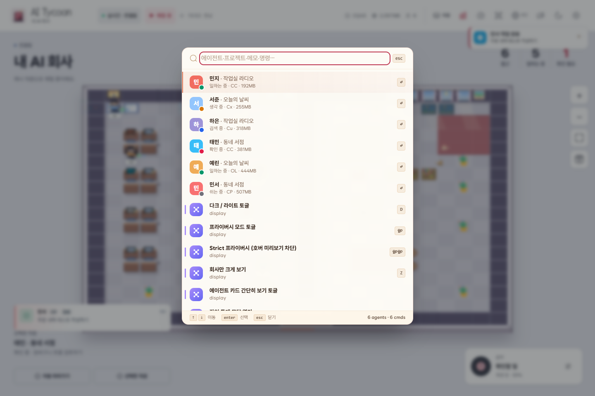

# 화면 모아 보기

2026년 9월 22일, 실제 앱을 체험 모드로 실행해 찍었습니다. 직원 이름과 작업 내용은 예시 데이터입니다. PC 화면은 1440×960, 모바일 화면은 390×844 크기입니다.

## 작은 회사

직원들의 행동을 보면서 확인할 일이 있는지 살펴봅니다. 오른쪽 패널에서 해당 작업을 열 수 있습니다.

## 모바일

회사·직원·기록을 하단 메뉴로 오갑니다. 목록에서 자세히 읽고 싶을 때는 직원 카드를 누르세요.

## 직원 상세

현재 작업과 메모를 먼저 보여줍니다. PID·세션·메모리 정보는 ‘세션·연결 정보’를 펼쳐 확인할 수 있습니다.

## 작업 통계

오늘의 활동과 도구별 작업, 프로젝트별 진행 상태를 모아 봅니다. 체험 모드의 통계는 실제 작업과 분리됩니다.

## 빠른 검색

`Ctrl+K` 또는 `Cmd+K`로 직원을 찾거나 자주 쓰는 기능을 실행할 수 있습니다.

## 캐릭터와 자세

앱에서 사용하는 픽셀 캐릭터를 정수 배율로 확대한 모습입니다. 별도 일러스트가 아니라 실제 화면과 직원 목록에 사용하는 같은 그림입니다.

## 직접 둘러보기

[실행 방법](../README.md#바로-실행하기)에 따라 앱을 켠 뒤 `http://localhost:3777/?demo=1`에 접속하세요. 음악은 화면 아래 라디오의 재생 버튼으로 켤 수 있습니다.
