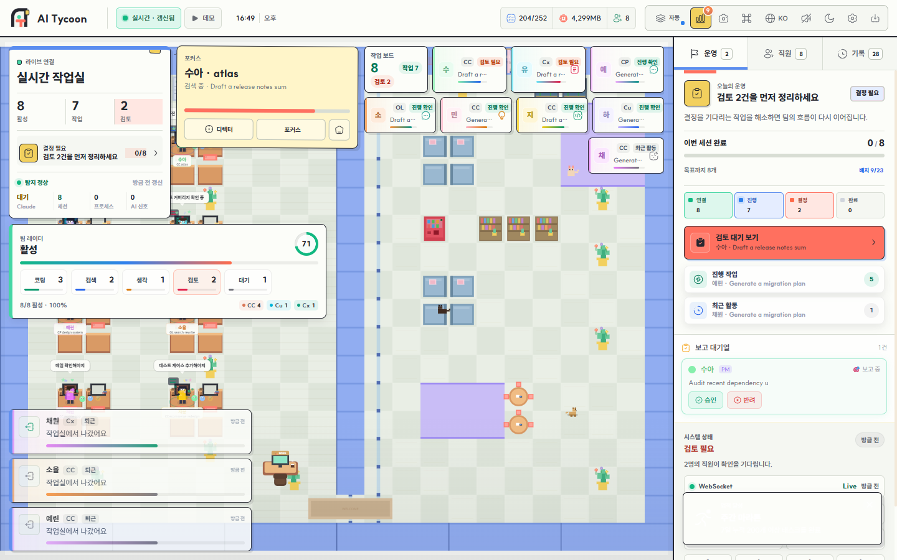
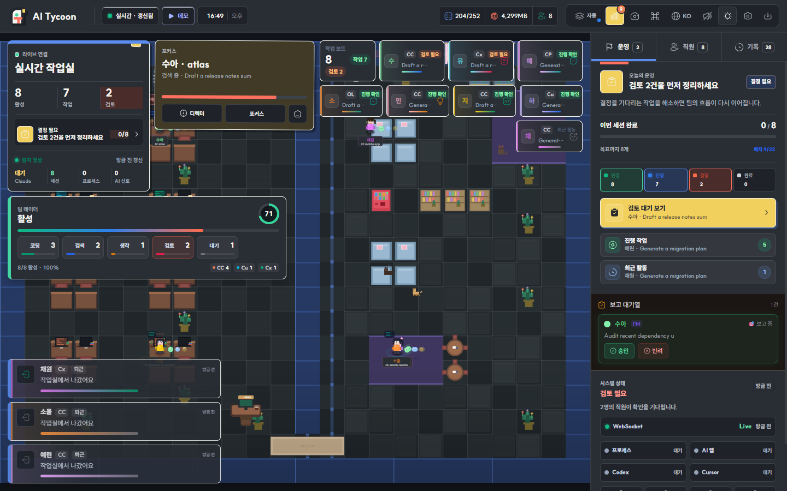
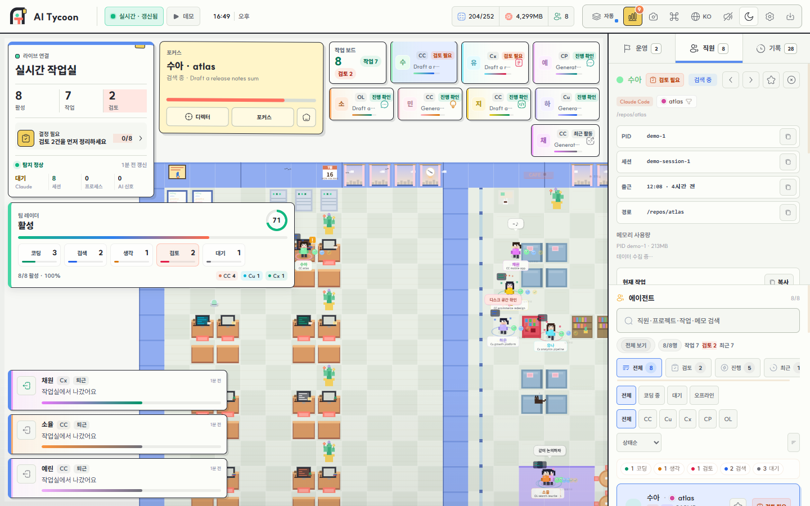
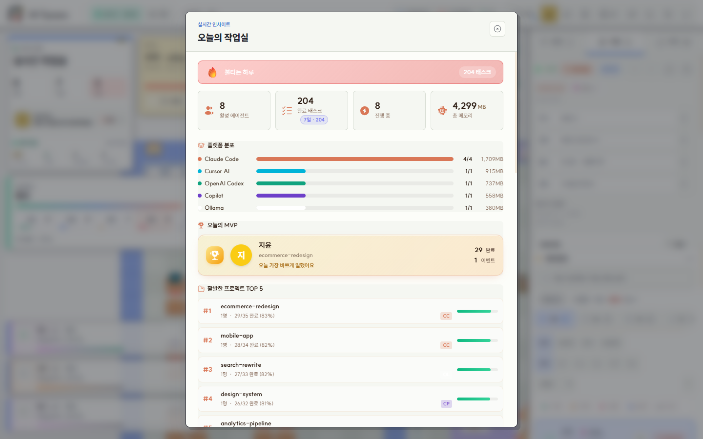
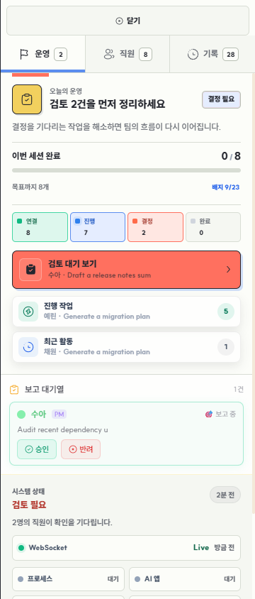

# AI Tycoon 화면

아래 이미지는 실제 앱을 `?demo=1`로 실행해 촬영했습니다. 화면에 표시된 직원과 작업은 문서용 합성 데이터입니다.

## 실시간 작업실

작업실과 운영 패널을 함께 보는 기본 화면입니다. 현재 인원, 작업 상태, 검토 대기 항목과 최근 활동을 한눈에 확인할 수 있습니다.

<p align="center">
  
</p>

<p align="center">
  
</p>

## 운영과 검토

우선 처리할 작업과 검토 대기열을 모은 화면입니다. 승인과 반려, 진행 작업 확인을 같은 패널에서 처리합니다.

<p align="center">
  
</p>

## 직원 상세

선택한 직원의 플랫폼, 세션, 프로젝트 경로, 현재 작업과 태스크를 확인하는 화면입니다. 메모와 활동 기록도 이곳에서 관리합니다.

<p align="center">
  
</p>

## 작업실 인사이트

오늘의 태스크, 플랫폼별 사용량, 가장 활발한 직원과 프로젝트를 요약합니다.

<p align="center">
  
</p>

## 모바일 운영

390px 화면에서 연 운영 패널입니다. 검토, 승인과 상태 확인을 작은 화면에서도 그대로 사용할 수 있습니다.

<p align="center">
  
</p>

## 직접 둘러보기

```bash
git clone https://github.com/easygap/AI-Tycoon.git
cd AI-Tycoon
npm install
npm start
```

실행 후 `http://localhost:3777/?demo=1`로 접속하면 실제 에이전트가 없어도 같은 흐름을 살펴볼 수 있습니다.
